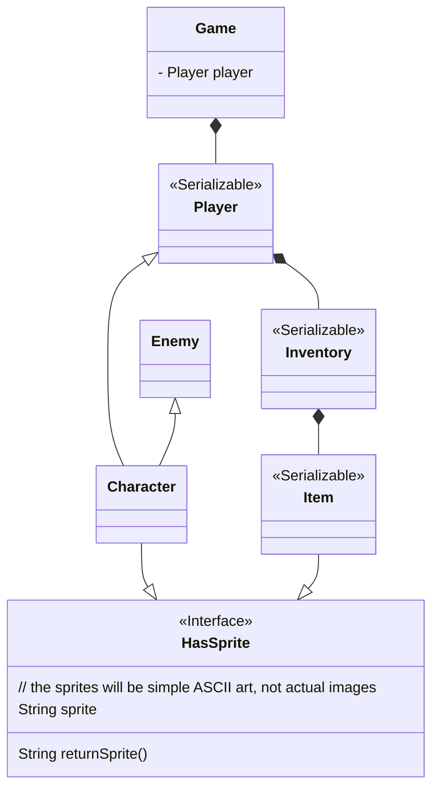

# CS121-Final

```mermaid
classDiagram
class Game {
    - Player player
}
class Character {

}
class Enemy {

}
class Player {
    <<Serializable>>
}
class Inventory {
    <<Serializable>>
}
class Item {
    <<Serializable>>
}
class HasSprite {
    // the sprites will be simple ASCII art, not actual images
    <<Interface>>
    String sprite
    String returnSprite()
}

Player <|-- Character
Enemy <|-- Character
Character --|> HasSprite
Item --|> HasSprite
Game *-- Player
Player *-- Inventory
Inventory *-- Item
```