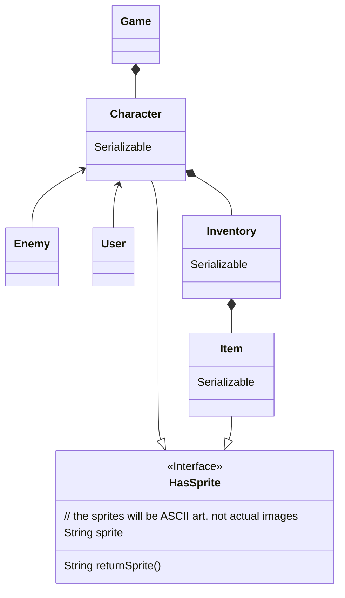

# CS121-Final

```mermaid
classDiagram
class Game {

}
class Character {
    Serializable

}
class Enemy {

}
class User {

}
class Inventory {
    Serializable
}
class Item {
    Serializable
}
class HasSprite {
    // the sprites will be ASCII art, not actual images
    <<Interface>>
    String sprite
    String returnSprite()
}

Character <-- User
Character <-- Enemy
Character --|> HasSprite
Item --|> HasSprite
Game *-- Character
Character *-- Inventory
Inventory *-- Item
```